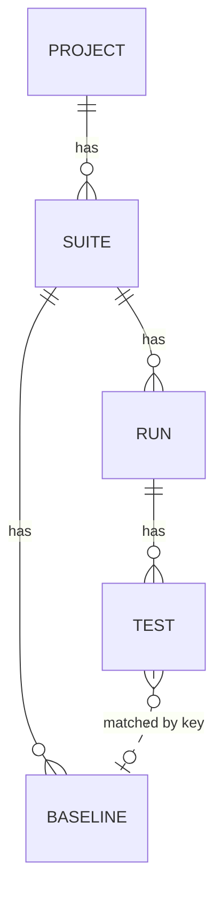

# Data model

Source of truth: `db/schema.rb` and `app/models/*.rb`. Migrations live in `db/migrate/`.

## ER diagram



`TEST` ↔ `BASELINE` is a soft link via the slugified `key` column, not a foreign key — see the [Key formula](#key-formula) below.

Hierarchy is strict cascading-delete (`dependent: :destroy`):

- Deleting a Project → destroys its Suites.
- Deleting a Suite → destroys its Runs **and** its Baselines, plus the tests via `has_many :tests, through: :runs, dependent: :destroy`.
- Deleting a Run → destroys its Tests.
- Deleting a Test → also deletes its thumbnail files on disk (after_destroy hook).

## Tables

### `projects`

| Column     | Type      | Notes                                                |
| ---------- | --------- | ---------------------------------------------------- |
| id         | integer   | PK                                                   |
| name       | string    | Required (validated only via app conventions, not DB)|
| slug       | string    | URL identifier, set from `name.parameterize` on init |
| created_at | datetime  |                                                      |
| updated_at | datetime  |                                                      |

Notes:
- `to_param` returns the slug, so URLs are `/projects/<slug>/...`.
- Slug is generated `after_initialize` only if blank — it does **not** update on rename. Two projects with names that parameterize to the same slug will conflict (no DB uniqueness constraint).

### `suites`

| Column     | Type      | Notes                       |
| ---------- | --------- | --------------------------- |
| id         | integer   | PK                          |
| name       | string    |                             |
| project_id | integer   | FK → projects.id (no DB FK) |
| slug       | string    | parameterize(name)          |
| created_at | datetime  |                             |
| updated_at | datetime  |                             |

Notes:
- `to_param` returns slug; URLs are `/projects/<p_slug>/suites/<s_slug>`.
- Has a `latest_run` helper (highest `id`) and `purge_old_runs` (destroys all runs past the 5 most recent, ordered by id desc).

### `runs`

| Column        | Type     | Notes                                                |
| ------------- | -------- | ---------------------------------------------------- |
| id            | integer  | PK                                                   |
| suite_id      | integer  | FK → suites.id (DB-level FK present)                 |
| sequential_id | integer  | per-suite counter, supplied by `acts_as_sequenced` (Rails gem)       |
| created_at    | datetime |                                                      |
| updated_at    | datetime |                                                      |

Indexes: `index_runs_on_suite_id`. Foreign key: `runs.suite_id → suites.id`.

Behaviour:
- `acts_as_sequenced scope: :suite_id` — sequential ids are 1-based and unique per suite. Resequencing is **not** done after deletes; the counter is monotonic.
- `to_param` returns `sequential_id.to_s`, so URLs are `/projects/<p>/suites/<s>/runs/<seq_id>`.
- `after_create :purge_old_runs` → invokes `suite.purge_old_runs` which `destroy_all`s any run beyond the 5 newest in this suite. **Hardcoded 5; no config knob.**
- JSON: `as_json` injects a `:url` key (the suite-scoped path).
- `passing_tests` / `failing_tests` are simple `where(pass: true|false).count` aggregates.

### `tests`

| Column                  | Type     | Notes                                              |
| ----------------------- | -------- | -------------------------------------------------- |
| id                      | integer  | PK                                                 |
| name                    | string   | Required                                           |
| browser                 | string   | Required                                           |
| size                    | string   | Required (free-text — "1024", "Desktop", etc.)     |
| run_id                  | integer  | FK → runs.id (DB-level FK present)                 |
| diff                    | float    | Percentage of differing pixels (rounded to 2 dp)   |
| screenshot_uid          | string   | Dragonfly UID for the original (or cropped) shot   |
| screenshot_baseline_uid | string   | Dragonfly UID for the baseline used during compare |
| screenshot_diff_uid     | string   | Dragonfly UID for the generated diff image         |
| key                     | string   | Computed identifier; see [Key formula](#key-formula)|
| pass                    | boolean  | Default false; true if `diff < 0.1`                |
| source_url              | string   | Optional URL for the page that was screenshotted   |
| fuzz_level              | string   | ImageMagick `-fuzz` value (e.g. "30%"). Default "30%". |
| highlight_colour        | string   | Hex without `#`, e.g. "ff0000". Default "ff0000".  |
| crop_area               | string   | ImageMagick crop spec `WxH+X+Y`. Optional.         |
| created_at              | datetime |                                                    |
| updated_at              | datetime |                                                    |

Indexes: `index_tests_on_run_id`. Foreign key: `tests.run_id → runs.id`.

Validations: `name`, `browser`, `size`, `run` are required.

Default scope: `order(:created_at)` (oldest first).

Lifecycle:
- `after_initialize :default_values` sets `diff ||= 0`, `pass ||= false`, `fuzz_level = '30%'` if blank, `highlight_colour = 'ff0000'` if blank.
- `after_create :create_key` computes and saves the key (see below).
- `after_save :update_baseline` if `pass` is true, upserts the matching Baseline row with this test's screenshot.
- `after_destroy :delete_thumbnails` removes thumbnail files from disk.

Methods of note:
- `pass?` → returns `pass` value.
- `baseline?` → does a Baseline exist with this test's key **and** `test_id == self.id` (i.e. is **this** test the source of the current baseline).
- `baseline` → returns the Baseline matching this key, regardless of source test.
- `url` → URL of the test's run page with `#test_<id>` anchor.
- `screenshot_thumbnail`, `screenshot_baseline_thumbnail`, `screenshot_diff_thumbnail` → `Thumbnail` objects (300px wide JPGs cached on local disk in `public/system/dragonfly/<env>/thumbnails`, keyed by SHA1 of `<key>_test_<id>_screenshot[ _baseline | _diff ]`).
- `five_consecutive_failures` → `true` if the last 5 tests with this key are all `pass: false`. (The view that surfaces this is currently commented out.)

#### Key formula

```ruby
self.key = "#{run.suite.project.name} #{run.suite.name} #{name} #{browser} #{size}".parameterize
```

So a test in project "Acme Site", suite "Desktop", name "Homepage", browser "Chrome", size "1024" gets key `acme-site-desktop-homepage-chrome-1024`.

Implications:
- Renaming a project/suite changes the key for all future tests, severing the connection to old baselines.
- `parameterize` collapses whitespace/casing/punctuation; "Home page" and "home-page" share a key.

### `baselines`

| Column         | Type     | Notes                                                              |
| -------------- | -------- | ------------------------------------------------------------------ |
| id             | integer  | PK                                                                 |
| name           | string   | Required                                                           |
| browser        | string   | Required                                                           |
| size           | string   | Required                                                           |
| suite_id       | integer  | FK → suites.id (DB-level FK present); required                     |
| screenshot_uid | string   | Dragonfly UID                                                      |
| key            | string   | Required; matches the Test's key                                   |
| test_id        | integer  | The Test that produced this baseline (no FK constraint in DB)      |
| created_at     | datetime |                                                                    |
| updated_at     | datetime |                                                                    |

Indexes: `index_baselines_on_suite_id`. Foreign key: `baselines.suite_id → suites.id`.

Validations: `key`, `name`, `browser`, `size`, `suite` required.

Default scope: `order(:created_at)`.

Lifecycle:
- `after_save :create_thumbnails` deletes any existing thumbnail and re-renders.
- `after_destroy :delete_thumbnails`.

There is **at most one Baseline per key in practice** because Tests upsert via `find_or_initialize_by(key: …)`, but the schema has no UNIQUE constraint on `key`.

`Baseline#screenshot_url` returns `/baselines/<key>.png` (a public route that streams the baseline image).

### `friendly_id_slugs` (legacy)

Empty in production; left over from a `friendly_id` migration that is no longer used. The schema retains the table for compatibility but **no model code references it**. Safe to drop in the rebuild.

## In-memory / non-persisted classes

These are POROs in `app/models/` that don't map to tables:

- **`Canvas`** (`app/models/canvas.rb`) — given two `ImageGeometry`s, returns the canvas dimensions for the comparison: `max(width)` × `max(height)`. Sets `dimensions_differ = true` if widths or heights don't match. Used to pad both images so ImageMagick `compare` can run.
- **`ScreenshotComparison`** (`app/models/screenshot_comparison.rb`) — orchestrates the diff (see [image-diffing.md](image-diffing.md)).
- **`TestFilters`** (`app/models/test_filters.rb`) — view-side helper for filtering tests by name/browser/size/status from `params`.
- **`Thumbnail`** (`app/models/thumbnail.rb`) — wraps a Dragonfly accessor + a key, lazily renders/caches a 300px-wide JPG thumbnail to `public/system/dragonfly/<env>/thumbnails/<sha1>`. Falls back to `/image_not_found.jpg` on any error.

## Migrations summary

The `db/migrate/` history shows the schema's evolution; for the rebuild, work from `schema.rb` (which is the authoritative state). Notable historical decisions:

- `width` was renamed to `size` (string) — sizes are not always numeric ("Desktop", "Mobile").
- `platform` was added then removed.
- `dimensions_changed` was added then removed; the live computation in `Canvas` replaced the persisted flag.
- `Baselines` were introduced separately from `Tests` (originally tests had a `baseline` boolean).
- `crop_area`, `fuzz_level`, `highlight_colour` and `source_url` were added incrementally to `tests`.
- `friendly_id` was added then effectively abandoned.

## Python (Django) mapping notes

- Single Django app called `core` containing Project, Suite, Run, Test, Baseline. Splitting into five apps would be over-engineering for this size.
- **Slugs auto-update on rename** (decided — [decisions.md](decisions.md) #4):
  ```python
  # Project / Suite
  def save(self, *args, **kwargs):
      self.slug = slugify(self.name)
      super().save(*args, **kwargs)
  ```
  Renaming re-slugs the project/suite, which **changes every contained Test's `key` on next ingest** and orphans existing baselines. The "new baseline" badge ([decisions.md](decisions.md) #3) surfaces this in the UI; the admin edit form should also warn before save (see [admin.md](admin.md)).
- **Per-suite sequential id** — add a `next_run_seq` column to `Suite` and increment under `select_for_update()`:
  ```python
  with transaction.atomic():
      suite = Suite.objects.select_for_update().get(pk=self.suite_id)
      self.sequential_id = suite.next_run_seq
      suite.next_run_seq += 1
      suite.save(update_fields=['next_run_seq'])
      super().save(*args, **kwargs)
  ```
  Don't use `Run.objects.filter(suite=…).count() + 1` — racy under concurrent inserts.
- **`key` field** — set in `Test.save()` from `slugify(f"{project.name} {suite.name} {name} {browser} {size}")` using `django.utils.text.slugify`. Match Rails's `parameterize` behaviour as closely as needed; differences in Unicode handling are unlikely to matter for ASCII test names but worth a unit test.
- **`purge_old_runs`** — post-save signal on `Run`:
  ```python
  retain = settings.RUN_RETENTION_PER_SUITE   # default 5
  ids = list(
      Run.objects.filter(suite=run.suite).order_by('-id').values_list('pk', flat=True)[retain:]
  )
  Run.objects.filter(pk__in=ids).delete()
  ```
  Django doesn't allow `.delete()` on a sliced queryset directly — materialize to a PK list first.
- **"New baseline" signal** — when `Test.save()` upserts a Baseline that did not previously exist for the key, mark this on the API response (e.g. `"is_new_baseline": true`). Surface as a Material chip in the SPA. Don't persist on the Test row — it's a per-run UI signal.
- **`dependent: :destroy`** → Django `on_delete=models.CASCADE` on the FK fields.
- **Field rename**: Rails has `pass` (boolean) on `Test`; `pass` is a Python keyword. Use `passed` on the model. The API still serializes the field as `"pass"` for CI client compatibility — set the DRF serializer's source mapping accordingly.
- Drop the `friendly_id_slugs` table.
- Make all FKs DB-level (`db_constraint=True` is the Django default; just don't disable it).

## Full model implementation

End-to-end translation of the five Rails models into Django. Two files: `core/models.py` (model classes) and `core/signals.py` (post-save hooks). Wire `signals.py` from `core/apps.py` so the handlers are registered at app boot.

### `core/models.py`

```python
from django.db import models, transaction
from django.utils.text import slugify


# Each FileField needs a top-level callable, not a closure — Django serializes
# `upload_to` references into migrations and can't import nested functions.

def test_screenshot_path(instance, _original_name):
    return f"screenshots/{instance.id}/original.png"


def test_baseline_path(instance, _original_name):
    return f"screenshots/{instance.id}/baseline.png"


def test_diff_path(instance, _original_name):
    return f"screenshots/{instance.id}/diff.png"


def test_screenshot_thumb_path(instance, _original_name):
    return f"screenshots/{instance.id}/thumb-300.jpg"


def test_baseline_thumb_path(instance, _original_name):
    return f"screenshots/{instance.id}/thumb-300-baseline.jpg"


def test_diff_thumb_path(instance, _original_name):
    return f"screenshots/{instance.id}/thumb-300-diff.jpg"


def baseline_screenshot_path(instance, _original_name):
    return f"baselines/{instance.key}/screenshot.png"


def baseline_thumbnail_path(instance, _original_name):
    return f"baselines/{instance.key}/thumb-300.jpg"


class Project(models.Model):
    name = models.CharField(max_length=255)
    slug = models.SlugField(max_length=255, unique=True)
    created_at = models.DateTimeField(auto_now_add=True)
    updated_at = models.DateTimeField(auto_now=True)

    class Meta:
        ordering = ['name']

    def save(self, *args, **kwargs):
        # Auto-update slug on rename (decisions.md #4) — old deep-links break,
        # and any Tests submitted after the rename will get new keys, severing
        # them from existing Baselines. The admin form should warn (admin.md).
        self.slug = slugify(self.name)
        super().save(*args, **kwargs)

    def __str__(self):
        return self.name


class Suite(models.Model):
    project = models.ForeignKey(Project, on_delete=models.CASCADE, related_name='suites')
    name = models.CharField(max_length=255)
    slug = models.SlugField(max_length=255)
    next_run_seq = models.PositiveIntegerField(default=1)   # see Run.save()
    created_at = models.DateTimeField(auto_now_add=True)
    updated_at = models.DateTimeField(auto_now=True)

    class Meta:
        ordering = ['name']
        constraints = [
            models.UniqueConstraint(fields=['project', 'slug'], name='unique_suite_slug_per_project'),
        ]

    def save(self, *args, **kwargs):
        self.slug = slugify(self.name)
        super().save(*args, **kwargs)

    def __str__(self):
        return f"{self.project.name} / {self.name}"


class Run(models.Model):
    suite = models.ForeignKey(Suite, on_delete=models.CASCADE, related_name='runs')
    sequential_id = models.PositiveIntegerField()   # per-suite, assigned in save()
    created_at = models.DateTimeField(auto_now_add=True)
    updated_at = models.DateTimeField(auto_now=True)

    class Meta:
        ordering = ['-id']
        constraints = [
            models.UniqueConstraint(fields=['suite', 'sequential_id'], name='unique_run_seq_per_suite'),
        ]

    def save(self, *args, **kwargs):
        # Race-safe per-suite sequential id. Don't use COUNT(*)+1 — concurrent
        # inserts would collide. select_for_update locks the Suite row for the
        # duration of the transaction so the increment is atomic.
        if self._state.adding:
            with transaction.atomic():
                suite = Suite.objects.select_for_update().get(pk=self.suite_id)
                self.sequential_id = suite.next_run_seq
                suite.next_run_seq += 1
                suite.save(update_fields=['next_run_seq'])
                super().save(*args, **kwargs)
        else:
            super().save(*args, **kwargs)

    def __str__(self):
        return f"{self.suite} run #{self.sequential_id}"


class Test(models.Model):
    run = models.ForeignKey(Run, on_delete=models.CASCADE, related_name='tests')
    name = models.CharField(max_length=255)
    browser = models.CharField(max_length=255)
    size = models.CharField(max_length=255)
    source_url = models.URLField(max_length=2048, blank=True, null=True)

    fuzz_level = models.CharField(max_length=10, default='30%')
    highlight_colour = models.CharField(max_length=6, default='ff0000')
    crop_area = models.CharField(max_length=64, blank=True, null=True)

    diff = models.FloatField(default=0)
    passed = models.BooleanField(default=False)
    key = models.CharField(max_length=512, db_index=True, blank=True)

    screenshot          = models.FileField(upload_to=test_screenshot_path,        null=True, blank=True)
    screenshot_baseline = models.FileField(upload_to=test_baseline_path,          null=True, blank=True)
    screenshot_diff     = models.FileField(upload_to=test_diff_path,              null=True, blank=True)
    screenshot_thumb           = models.FileField(upload_to=test_screenshot_thumb_path, null=True, blank=True)
    screenshot_baseline_thumb  = models.FileField(upload_to=test_baseline_thumb_path,   null=True, blank=True)
    screenshot_diff_thumb      = models.FileField(upload_to=test_diff_thumb_path,       null=True, blank=True)

    created_at = models.DateTimeField(auto_now_add=True)
    updated_at = models.DateTimeField(auto_now=True)

    class Meta:
        ordering = ['created_at']

    def save(self, *args, **kwargs):
        # Recompute the key on every save so it always reflects the current
        # project/suite slug. If a project is renamed, the next Test save
        # auto-orphans its connection to the old Baseline (decisions.md #4).
        self.key = self._compute_key()
        super().save(*args, **kwargs)

    def _compute_key(self) -> str:
        suite = self.run.suite
        return slugify(f"{suite.project.name} {suite.name} {self.name} {self.browser} {self.size}")

    def __str__(self):
        return f"{self.name} ({self.browser}, {self.size})"


class Baseline(models.Model):
    suite = models.ForeignKey(Suite, on_delete=models.CASCADE, related_name='baselines')
    test  = models.ForeignKey(Test, on_delete=models.SET_NULL, null=True, blank=True,
                              help_text="Test that produced this baseline; informational only.")
    name = models.CharField(max_length=255)
    browser = models.CharField(max_length=255)
    size = models.CharField(max_length=255)
    key = models.CharField(max_length=512, unique=True, db_index=True)

    screenshot = models.FileField(upload_to=baseline_screenshot_path, null=True, blank=True)
    thumbnail  = models.FileField(upload_to=baseline_thumbnail_path,  null=True, blank=True)

    created_at = models.DateTimeField(auto_now_add=True)
    updated_at = models.DateTimeField(auto_now=True)

    class Meta:
        ordering = ['created_at']

    def __str__(self):
        return self.key
```

Two changes from the legacy schema worth flagging:

- **`Baseline.key` is `unique=True`** — the legacy schema lacks this constraint, which is what allows the race documented in `image-diffing.md`. The DB constraint plus `select_for_update()` in the upsert path closes the race two ways.
- **`Suite.slug` is unique per-project, not globally** — the Rails app had no constraint at all (two suites with the same name in different projects "worked" but two with the same name in the same project would silently collide). Per-project uniqueness is the obvious meaning.
- **`Project.slug` is globally unique** (`unique=True`). Two projects whose names slugify to the same value (e.g. "Acme Inc" and "Acme  Inc") raise `IntegrityError` on the second save. This is stricter than legacy and intentional — silent slug collisions broke routing in the Rails app. The admin's rename-warning template ([admin.md](admin.md)) is the operator-facing safety net; treat the `IntegrityError` as the developer-facing one.

### `core/signals.py`

```python
import logging

from django.conf import settings
from django.db.models.signals import post_save
from django.dispatch import receiver

from .models import Run

logger = logging.getLogger(__name__)


@receiver(post_save, sender=Run)
def purge_old_runs(sender, instance, created, **kwargs):
    """Keep only the N most recent runs per suite; cascade-delete everything older.

    Default N is 5 (decisions.md #1; legacy parity). Configurable via
    RUN_RETENTION_PER_SUITE. Rebuild parity with Suite#purge_old_runs in
    app/models/suite.rb of the Rails app.
    """
    if not created:
        return

    retain = settings.RUN_RETENTION_PER_SUITE
    stale_ids = list(
        Run.objects
            .filter(suite_id=instance.suite_id)
            .order_by('-id')
            .values_list('pk', flat=True)[retain:]
    )
    if stale_ids:
        # Materialize to a PK list first — Django doesn't allow .delete()
        # on a sliced queryset directly.
        Run.objects.filter(pk__in=stale_ids).delete()
        logger.info("purged old runs", extra={
            'suite_id': instance.suite_id, 'purged': len(stale_ids), 'retained': retain,
        })
```

### `core/apps.py`

```python
from django.apps import AppConfig


class CoreConfig(AppConfig):
    default_auto_field = 'django.db.models.BigAutoField'
    name = 'core'

    def ready(self):
        from . import signals   # noqa: F401  — registers the post_save receiver
```

### Why post-save signal instead of `Run.save()` override

The Rails app uses an `after_create` callback on `Run`. The Django-idiomatic translation is a `post_save` signal — same lifecycle position, but separated from the model so the deletion logic is testable in isolation and isn't invoked by every `Run.save()` (only by creates).

`Run.save()` already has the `select_for_update`-based sequential-id assignment. Adding the purge there too would make `save()` do three things (assign id, save row, delete old siblings). The signal split keeps each method narrowly scoped.

### What's deliberately not in the model

- **No baseline upsert in `Test.save()`.** The legacy app uses an `after_save :update_baseline` hook on Test that fires whenever `pass` flips to `true`, including from the "set as baseline" PATCH. The rebuild moves that logic into `screenshot_comparison.py` (for the diff path) and `_set_as_baseline` in `core/views/legacy.py` (for the PATCH path). Reasons: (a) the upsert needs to attach the screenshot file, which the model doesn't have access to mid-save; (b) the legacy hook silently fires on any save, which makes admin edits to a Test mutate Baselines unexpectedly.
- **No thumbnail rendering in `Test.save()`.** Same reasoning — explicit calls from the service layer ([storage-and-thumbnails.md](storage-and-thumbnails.md)) instead of an implicit hook.
- **No `default_scope`.** Rails's `default_scope ordering` is a known footgun. The two `Meta.ordering` declarations cover the common cases; queries that need a different order should be explicit about it.
